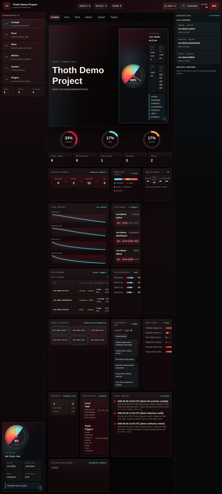
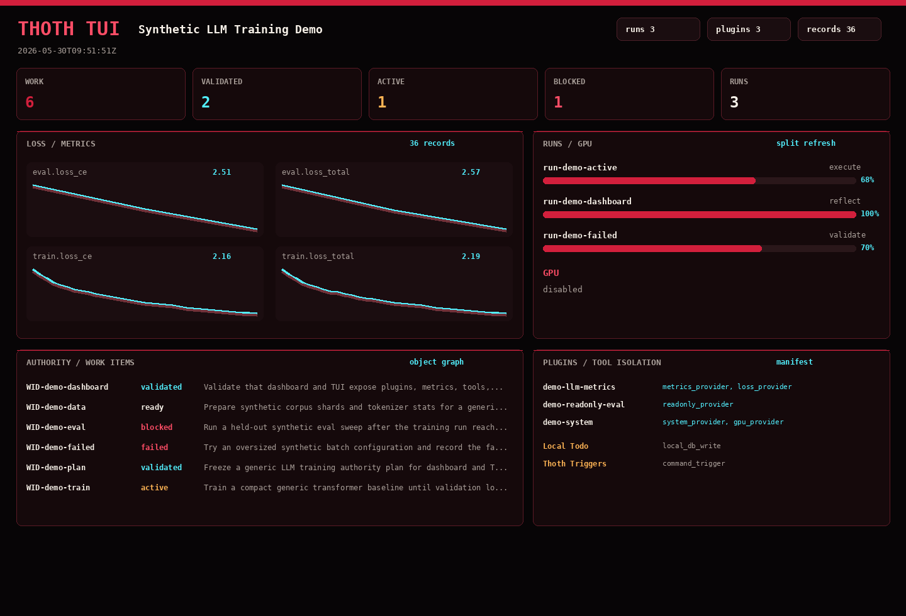

[English](./README.md) | [简体中文](./README.zh-CN.md)

<div align="center">
  <h1>🐦 Thoth — Dashboard-First Runtime for Autoresearch</h1>
  
  <p><strong>Dashboard-first orchestration runtime for autoresearch.</strong></p>
  <p>Turn drifting agent work into durable runs, locked work items, and argument-backed verdicts.</p>
  <p>
    
    
    
    
  </p>
  <p>
    
    
    
    
    
  </p>
  <h2>🚀 What's New</h2>
  <p><strong>v0.4.1 Dashboard/TUI v2</strong> · Query-backed cockpit, scoped SSE invalidation, compact backend/TUI internals, and preserved v4 visuals</p>
  
  <br />
  
</div>

## Control Plane At A Glance

```text
                               THOTH CONTROL PLANE

                    Claude Code surfaces      Codex surfaces
                 /thoth:* command set        $thoth command set
                              \                 /
                               \               /
                                +-------------+
                                              |
                                              v

+----------------------------------------------------------------------------+
| Layer 1. Host Surface                                                      |
|                                                                            |
|  init   discuss   run   loop   argue   auto   status                       |
|  doctor dashboard tui plugin                                              |
+----------------------------------------------------------------------------+
                                              |
                                              v
+----------------------------------------------------------------------------+
| Layer 2. Planning Authority                                                |
|                                                                            |
|  init      -> bootstrap/migrate/resync or open raw intent discussion       |
|  discuss   -> record discussions, decisions, work items, and work_graphs   |
|                                                                            |
|  Discuss -> Decision -> Work Item Object Graph                             |
|                                         |                                  |
|                                         v                                  |
|                               Ready Work (--work-id)                      |
+----------------------------------------------------------------------------+
                                              |
                                              v
+----------------------------------------------------------------------------+
| Layer 3. Execution Runtime                                                 |
|                                                                            |
|  run      -> one durable execution packet                                  |
|  loop     -> one durable recoverable loop packet                           |
|  argue    -> adversarial discussion and authority patch preview            |
|  auto     -> DAG-first child loops for actionable work                     |
|                                                                            |
|                           +---------------------------+                    |
|                           | Ready Work (--work-id)   |                    |
|                           +-------------+-------------+                    |
|                                         |                                  |
|                              +----------+----------+                       |
|                              |                     |                       |
|                              v                     v                       |
|                            Run                   Loop                      |
|                              |                     |                       |
|                              +----------+----------+                       |
|                                         |                                  |
|                                         v                                  |
|                 Run Ledger / Events / Artifacts / Result                   |
|                                         |                                  |
|                                         v                                  |
|                  Mechanical Validation / Acceptance                        |
|                                                                            |
|  attach   watch   resume   stop                                            |
+----------------------------------------------------------------------------+
                                              |
                                              v
+----------------------------------------------------------------------------+
| Layer 4. Read Surfaces                                                     |
|                                                                            |
|  dashboard -> human-visible runtime workbench                              |
|  tui       -> terminal snapshots over the same read providers              |
|  status    -> active / stale / attachable run summaries                    |
|  doctor    -> strict health, projection, and runtime-shape audit           |
|  report    -> available through status --report                           |
|                                                                            |
|                +-----------+-----------+-----------+-----------+------+    |
|                |           |           |           |           |           |
|                v           v           v           v           v           |
|             Dashboard      TUI       Status      Report      Doctor        |
+----------------------------------------------------------------------------+

Key invariants:
- .thoth is the shared machine/runtime authority
- .agent-os is the human governance layer
- run and loop are strict --work-id surfaces
- auto executes only actionable ready/active/failed work; blocked and draft work require human decisions
- dashboard, tui, status, report, and doctor are read surfaces, not authority writers
- run, loop, and auto progress through the RuntimeDriver until terminal or paused
```

## Why Thoth

Thoth is a dashboard-first orchestration runtime for autoresearch. It assumes chat alone is not an operating system: truth must survive the session, progress must stay visible, and completion must be mechanically testable.

## Failure Modes Table

| Problem | Why it matters |
| --- | --- |
| Work is not persistent | Long-running work dies with the session, so the agent cannot keep working while you sleep and there is no durable state to resume or audit. |
| Parallel work is invisible | Multiple threads or delegated runs drift apart, and humans cannot see what is actually active. |
| Agents can claim completion too early | A fluent summary can hide that nothing mechanical passed. |
| Docs and state rot over time | Discussions, decisions, work items, and runtime facts drift until nobody knows which layer is authoritative. |

## Thoth Response Table

| Mechanism | What it does | Counters |
| --- | --- | --- |
| Hooks + watchdog + runtime | Keep execution attached to durable ledgers and observable lifecycle events. | Work is not persistent |
| Dashboard-first visibility | Show live, stale, attachable, and host-specific runtime truth in one read surface. | Parallel work is invisible |
| Mechanical yes/no acceptance | Force validators, ledgers, and result payloads to decide whether work really passed. | Agents can claim completion too early |
| Object graph + execution system + locked work items | Freeze what is allowed, compile it into compact accepted work items, and keep authority layers from drifting. | Docs and state rot over time |

## Smart Init And Compact DAGs

`thoth init` now has two explicit personalities. With no natural-language intent it remains an audit-first mechanical bootstrap, sync, or migration command. With intent, for example `thoth init -- "build a multimodal research project..."`, it first materializes the base `.thoth` project and then stores the raw user text in an open `source=init:*` discussion. It does not fabricate ready work from that text and it does not bake an unconfirmed summary into generated `AGENTS.md` or `CLAUDE.md`.

When the discussion is ready to close, agents can use either one compact `work_item` or a compact `work_graph` blueprint. A `work_graph` is only `nodes` keyed by explicit stable `work_id` plus `edges`; each edge means `to` depends on `from` and is stored as canonical `depends_on` links. Nodes use only `title`, `goal`, `context`, `constraints`, `acceptance_spec`, `approach_notes`, and `missing_questions`. Init discussions may also include a small `project_patch` with only `name`, `description`, and `directions`; ordinary discussions cannot patch project identity.

Dashboard DAG nodes preserve authority status. A ready work item whose hard dependencies are not yet `validated` stays `ready`, while the DAG side panel shows `actionability=waiting_on` and the exact upstream work ids.

## System At A Glance

Humans should not spend their attention tracking every grain of sand in the funnel. Thoth lets AI own the middle of the hourglass, while the dashboard shows the gold that survives: decisions, work items, runs, results, and the current verdict.

## Architecture Flow Table

| Stage | Purpose | Input | Output |
| --- | --- | --- | --- |
| Intent | Capture the user request and operating boundary. | Human goals, constraints, repo context | Direction for planning |
| Decision | Lock key choices before execution drifts. | Intent, open questions, policy constraints | Recorded decisions |
| Work Item | Freeze goal, context, constraints, acceptance spec, approach notes, scheduling, run limits, and missing questions. | Discussion, decisions, requirements, acceptance rules | Ready or blocked work item |
| Run | Execute one frozen `work_id@revision` through phase results. | Work item, controller policy, host surface | `.thoth/objects/run` plus `.thoth/runs/<run_id>` ledger |
| Result | Produce a mechanical verdict instead of narration alone. | Validator outputs, artifacts, runtime checks | Structured result and acceptance evidence |
| Dashboard / TUI | Let humans read the final state without replaying the chat. | Portable authority plus local ledgers, extensions, and read providers | Inspectable project truth in browser or terminal |

## Portable Authority And Local State

Thoth project state is intentionally split into three layers.

Portable authority is the Git state needed to continue work after a fresh clone. Commit `AGENTS.md`, `CLAUDE.md` when the Claude surface is enabled, `.thoth/objects/project/`, `.thoth/objects/work_item/`, `.thoth/objects/discussion/`, `.thoth/objects/decision/`, `.thoth/extensions/`, `.thoth/docs/agent-entry.md`, `.thoth/docs/project.json`, and `.thoth/docs/source-map.json`. These files define the project, discussion history, decisions, accepted work item graph, and project-local read extensions.

Runtime evidence is local by default. New projects get `.thoth/.gitignore` rules for `.thoth/runs/`, `.thoth/derived/`, `.thoth/docs/work-results/`, `.thoth/objects/run/`, `.thoth/objects/artifact/`, `.thoth/objects/controller/`, and `.thoth/objects/phase_result/`. These ledgers remain on disk for local audit, but a fresh machine should start a new run rather than attach to old PIDs, leases, workers, supervisors, or dashboard processes.

Dashboard dependencies and cache are also local. Thoth writes idempotent ignore rules for `tools/dashboard/frontend/node_modules/`, `tools/dashboard/frontend/dist/`, Vite cache, backend Python cache, and the dashboard SQLite read model under `.thoth/derived/dashboard/`. If a team intentionally wants to carry a run to another machine, export a concise report with `thoth status --report` or archive the specific `.thoth/runs/<run_id>` evidence bundle explicitly; Thoth does not add every runtime ledger to Git by default.

The dashboard binds to `127.0.0.1` by default. Local write actions such as trigger, sync, health-check, and todo updates require a per-project action token stored under `.thoth/local/dashboard/action-token`; read endpoints stay available without that token.

`thoth init --sync` refreshes the managed dashboard scaffold when the installed plugin has newer runtime/read-model fixes. The previous scaffold is copied to ignored `.thoth/derived/dashboard-sync-backups/` before overwrite, so stale dashboard code can be recovered without making local backup files Git-visible. The portable `.thoth/extensions/manifest.json` and `.thoth/extensions/plugins/` tree are preserved; metrics and loss curves must be attached through an enabled extension provider rather than inferred by scanning arbitrary project folders.

Fresh-clone recovery means:

```bash
git clone <repo>
cd <repo>
codex plugin marketplace upgrade thoth
thoth doctor --version
thoth status --json
thoth run --work-id <ready-work-id>
```

That flow resumes from committed authority and starts new local runtime evidence. It does not take over old machine-local processes.

## Quick Start

1. Install Thoth on the host surfaces you use.

```bash
claude plugin marketplace add SeeleAI/Thoth --scope user
claude plugin install thoth@thoth --scope user
codex plugin marketplace add SeeleAI/Thoth
```

For Codex, adding the marketplace is the source step. Then install or enable the `thoth` plugin from the Codex plugin directory.

After the plugin is installed, two different entry layers exist on purpose:

- Public plugin surface: `Claude /thoth:*`, `Codex $thoth <command>`, and the plugin-provided shell wrapper `thoth <command>`
- Source-repo development fallback: `python -m thoth.cli <command>`

Use the plugin-installed `thoth` wrapper in fresh repos or empty directories. Use `python -m thoth.cli` only when you are intentionally running against a checked-out Thoth source tree and want execution pinned to that exact checkout.

2. Initialize the repository you want Thoth to manage.

```text
/thoth:init
$thoth init
```

3. Start the first strict run from a compiled task.

```text
/thoth:run --work-id task-1
$thoth run --work-id task-1
```

4. Open the read surface.

```text
/thoth:dashboard
$thoth dashboard
/thoth:tui --snapshot-json
$thoth tui --snapshot-json
```

You can run the interactive TUI from any repository that has already completed `thoth init`:

```bash
cd /path/to/your/project
thoth tui
```

`thoth tui` is read-only. It uses the same shared providers as the dashboard, so loss/metrics data must come from enabled `.thoth/extensions/manifest.json` providers. The interactive view supports `Tab` / `Shift+Tab`, arrow selection, `Enter` detail, `Esc` back, `/` search, `s` EMA emphasis, `d` decimal precision, `?` help, and `r` refresh. Python TUI extensions are loaded only when the manifest entry is enabled, targets the `tui` surface, declares `tui_python_plugin` or `tui_panel`, and explicitly sets `trusted: true`; use `--no-python-plugins` for a renderer-free safe launch.

## Host Install And Upgrade

| Host | First install | Stable upgrade | Important note |
| --- | --- | --- | --- |
| Claude Code | `claude plugin marketplace add SeeleAI/Thoth --scope user` then `claude plugin install thoth@thoth --scope user` | `claude plugin marketplace update thoth` then `claude plugin update thoth@thoth --scope user` | Restart Claude Code after `plugin update` so the new version is applied. |
| Codex | `codex plugin marketplace add SeeleAI/Thoth`, then install or enable `thoth` from the Codex plugin directory | `codex plugin marketplace upgrade thoth` | `add` takes a source such as `SeeleAI/Thoth`; `upgrade` takes the configured marketplace name, which is `thoth` in this repo. |

## Verification

Default development verification is intentionally targeted-only. Broad or full sweeps are not the normal workflow.

### Atomic selftest

- The public selftest entrypoint is now atomic-only:

```bash
python -m thoth.selftest --case plan.discuss.compile --case runtime.run.live
```

- `python -m thoth.selftest` without any `--case` fails on purpose and prints the available case catalog.
- Every case runs in its own workdir and artifact directory, writes a per-case report entry keyed by `case_id`, and must not depend on side effects from an earlier case.
- Release, regression, and closeout gates must record explicit case IDs instead of broad aliases such as `hard` or `heavy`.
- The current catalog is split into repo-local capability probes such as `plan.discuss.compile`, `runtime.run.live`, `runtime.loop.sleep`, `argue.adversarial`, `observe.dashboard`, `hooks.codex`, plus host-surface probes such as `surface.codex.run.live_prepare` and `surface.claude.loop.stop`.

### Targeted pytest

- Allowed developer entrypoints:

```bash
python -m pytest -q tests/unit/test_selftest_registry.py
python -m pytest -q tests/unit/test_selftest_helpers.py::test_validate_pytest_invocation
python -m pytest -q --thoth-target selftest-core
```

- Blocked by default: bare `pytest`, directory-wide invocations such as `pytest tests/unit`, and broad tier sweeps such as `pytest --thoth-tier heavy`.
- Broad runs are reserved for explicit release or CI situations and require `--thoth-allow-broad` or `THOTH_ALLOW_BROAD_TESTS=1`.
- `--thoth-tier` is retained only as an explicit override path for those exempted broad runs; it is not the default development interface.
- The target manifest lives in `thoth/test_targets.py`.
- Use the helper below to translate changed paths into recommended pytest targets and atomic selftest cases:

```bash
python scripts/recommend_tests.py thoth/observe/selftest/runner.py tests/conftest.py
```

## Command Matrix

| Command | Host Surface | Purpose | Input | Result |
| --- | --- | --- | --- | --- |
| `init` | `Claude: /thoth:init`<br>`Codex: $thoth init` | Audit, initialize, migrate, resync, or capture natural-language project intent as a `source=init:*` discussion. | `--sync`, `--migrate preview`, `--migrate apply`, `--migrate --preview`, `--migrate --apply`, `--config-json`, `--intent`, `--intent-file`, `[--] [intent...]` | Portable `.thoth` authority, migration ledger, raw intent discussion packet, ignore rules, generated projections, dashboard scaffolding, scripts, and tests |
| `discuss` | `Claude: /thoth:discuss`<br>`Codex: $thoth discuss` | Record planning decisions without entering code execution. | Topic, decision payload, compact work payload, or compact work_graph payload | Updated discussion, decision, work_item objects, canonical dependency links, and generated docs view |
| `run` | `Claude: /thoth:run`<br>`Codex: $thoth run` | Execute one ready work item through a durable runtime packet. | `--work-id`, optional host or executor controls, optional attach/watch/stop | Durable run ledger with state, events, phase results, artifacts, and terminal result |
| `loop` | `Claude: /thoth:loop`<br>`Codex: $thoth loop` | Iterate on one ready work item through a controller service. | `--work-id`, optional resume or sleep controls | Controller object, child run lineage, and bounded iteration history |
| `argue` | `Claude: /thoth:argue`<br>`Codex: $thoth argue` | Run an adversarial attacker/adjudicator discussion against an idea, work item, or decision without silently mutating authority. | `--work-id`, `--decision-id`, `--target-kind`, `--target-id`, free-text idea, or confirmed `--apply-artifact` | Argument ledger with full attack/adjudication artifacts, `decision_impact`, and confirmation-required authority patch preview |
| `auto` | `Claude: /thoth:auto`<br>`Codex: $thoth auto` | Run the DAG-first actionable queue while the user is away. | Optional `--sleep`, `--rounds`, `--scope all-open|ready`, or explicit `--work-id` | Auto controller, durable background worker, sparse foreground watch events, child loop lineage, and terminal or paused summary |
| `status` | `Claude: /thoth:status`<br>`Codex: $thoth status` | Show project health, active durable runs, doctor, report, or dashboard views. | Optional `--json`, `--doctor`, `--report`, or `--dashboard` | Shared status snapshot and read-only derived views |
| `doctor` | `Claude: /thoth:doctor`<br>`Codex: $thoth doctor` | Alias for `status --doctor`; strictly audit health and runtime shape. | Optional `--quick` or `--json` | Health report with validation findings |
| `dashboard` | `Claude: /thoth:dashboard`<br>`Codex: $thoth dashboard` | Alias for `status --dashboard`; manage the local dashboard runtime. | Optional action: `start`, `stop`, or `rebuild` | Local dashboard process and read endpoints backed by authority plus local `.thoth` ledgers |
| `tui` | `Claude: /thoth:tui`<br>`Codex: $thoth tui` | Open or snapshot the read-only terminal dashboard backed by shared providers. | Optional `--snapshot-json`, `--export-snapshots`, `--snapshot-dir`, `--no-gpu`, `--no-python-plugins`, loss detail and refresh controls | ANSI-free JSON or visual snapshots for authority, runs, metrics, plugins, tools, and system state |
| `plugin` | `Claude: /thoth:plugin`<br>`Codex: $thoth plugin` | Create, list, or validate project-local Dashboard/TUI extension plugins. | `create <plugin_id>`, `list`, `validate [--fix]` plus manifest metadata flags | `.thoth/extensions/manifest.json`, `.thoth/extensions/plugins/<plugin_id>/`, and local action receipts |

## Why Trust It

| Signal | What you can inspect |
| --- | --- |
| Local runtime truth | `.thoth/runs/*` keeps run, state, events, artifacts, and result payloads on the current machine by default. |
| Locked planning authority | `.thoth/objects/discussion/`, `.thoth/objects/decision/`, and `.thoth/objects/work_item/` define what execution is allowed to do. |
| Script-backed verification | Validators, doctor checks, and selftests decide pass or fail mechanically. |
| Shared read model | `status`, `report`, `dashboard`, and `tui` all read from shared providers instead of chat memory. |
| Host-aligned execution | Claude defaults to Claude workers and Codex defaults to Codex workers; explicit `--executor claude|codex` remains available for deliberate cross-host runs. |

## Who It Is For

| Good fit | Why |
| --- | --- |
| Research and experimentation repos | They need durable memory, replayable results, and visible long-running work. |
| Engineering teams using AI for real changes | They need code execution, adversarial critique, and acceptance to stay auditable. |
| Teams that want Claude Code and Codex parity | They need one host-neutral command model rather than two drifting workflows. |

## Current Limitations

| Current boundary | Implication |
| --- | --- |
| `run` and `loop` are strict `--work-id` surfaces | Free-form execution is intentionally rejected. |
| Host parity is semantic, not identical UX | Claude and Codex still need their own install and local runtime wiring. |
| Dashboard is a local service, not a hosted control plane | Operators need a machine that can run the backend and frontend assets. |
| The hero logo currently ships as a raster PNG | A clean SVG and icon-family refinement is still useful for smaller surfaces and plugin packaging. |

---

## Contributors

Built in public by contributors who want AI work to remain inspectable.

[](https://github.com/SeeleAI/Thoth/graphs/contributors)

Contribution path: [open a pull request](https://github.com/SeeleAI/Thoth/pulls) or [start a discussion](https://github.com/SeeleAI/Thoth/discussions).

## License

MIT. See [LICENSE](LICENSE).
