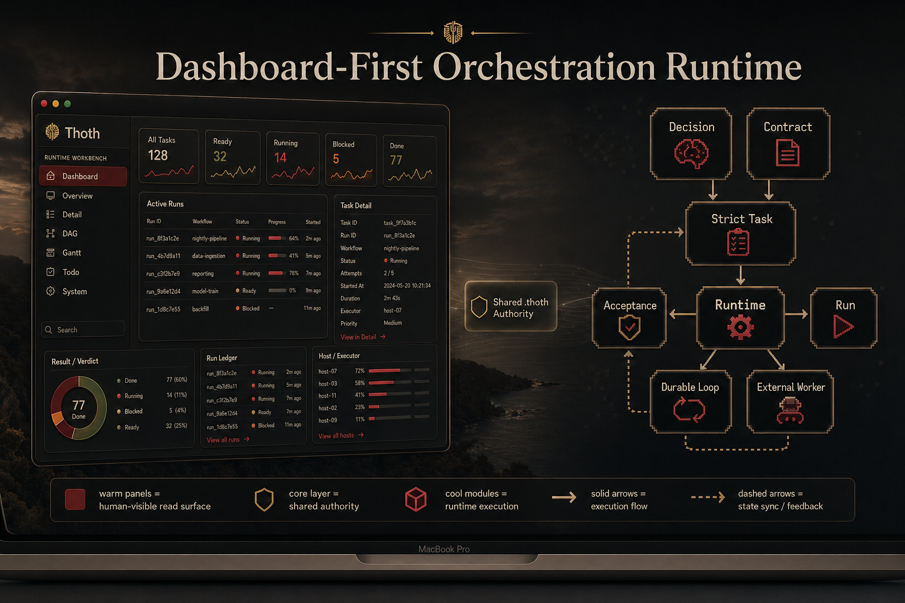

[English](./README.md) | [简体中文](./README.zh-CN.md)

<div align="center">
  <h1>🐦 Thoth — Dashboard-First Runtime for Autoresearch</h1>
  
  <p><strong>Dashboard-first orchestration runtime for autoresearch.</strong></p>
  <p>Turn drifting agent work into durable runs, locked work items, and reviewable verdicts.</p>
  <p>
    
    
    
    
  </p>
  <p>
    
    
    
    
    
  </p>
  
</div>

## Control Plane At A Glance

```text
                               THOTH CONTROL PLANE

                    Claude Code surfaces      Codex surfaces
                 /thoth:* command set        $thoth command set
                              \                 /
                               \               /
                                +-------------+
                                              |
                                              v

+----------------------------------------------------------------------------+
| Layer 1. Host Surface                                                      |
|                                                                            |
|  init   discuss   run   loop   review   status   dashboard                 |
|  report doctor    sync  extend                                             |
+----------------------------------------------------------------------------+
                                              |
                                              v
+----------------------------------------------------------------------------+
| Layer 2. Planning Authority                                                |
|                                                                            |
|  init      -> bootstrap .thoth authority and host projections              |
|  discuss   -> record discussions, decisions, and work items                |
|  sync      -> regenerate projections and derived surfaces                  |
|                                                                            |
|  Discuss -> Decision -> Work Item Object Graph                             |
|                                         |                                  |
|                                         v                                  |
|                               Ready Work (--work-id)                      |
+----------------------------------------------------------------------------+
                                              |
                                              v
+----------------------------------------------------------------------------+
| Layer 3. Execution Runtime                                                 |
|                                                                            |
|  run      -> one durable execution packet                                  |
|  loop     -> one durable recoverable loop packet                           |
|  review   -> structured findings through the same protocol                 |
|                                                                            |
|                           +---------------------------+                    |
|                           | Ready Work (--work-id)   |                    |
|                           +-------------+-------------+                    |
|                                         |                                  |
|                              +----------+----------+                       |
|                              |                     |                       |
|                              v                     v                       |
|                            Run                   Loop                      |
|                              |                     |                       |
|                              +----------+----------+                       |
|                                         |                                  |
|                                         v                                  |
|                 Run Ledger / Events / Artifacts / Result                   |
|                                         |                                  |
|                                         v                                  |
|                  Mechanical Validation / Acceptance                        |
|                                                                            |
|  attach   watch   resume   stop                                            |
+----------------------------------------------------------------------------+
                                              |
                                              v
+----------------------------------------------------------------------------+
| Layer 4. Read Surfaces                                                     |
|                                                                            |
|  dashboard -> human-visible runtime workbench                              |
|  status    -> active / stale / attachable run summaries                    |
|  report    -> derived project truth from current authority                 |
|  doctor    -> health, projection, and runtime-shape audit                  |
|                                                                            |
|                     +-----------+-----------+-----------+-----------+      |
|                     |           |           |           |                  |
|                     v           v           v           v                  |
|                 Dashboard    Status      Report      Doctor                |
+----------------------------------------------------------------------------+

Key invariants:
- .thoth is the shared machine/runtime authority
- .agent-os is the human governance layer
- run and loop are strict --work-id surfaces
- dashboard, status, report, and doctor are read surfaces, not authority writers
- run and loop progress through the RuntimeDriver until terminal
```

## Why Thoth

Thoth is a dashboard-first orchestration runtime for autoresearch. It assumes chat alone is not an operating system: truth must survive the session, progress must stay visible, and completion must be mechanically testable.

## Failure Modes Table

| Problem | Why it matters |
| --- | --- |
| Work is not persistent | Long-running work dies with the session, so the agent cannot keep working while you sleep and there is no durable state to resume or audit. |
| Parallel work is invisible | Multiple threads or delegated runs drift apart, and humans cannot see what is actually active. |
| Agents can claim completion too early | A fluent summary can hide that nothing mechanical passed. |
| Docs and state rot over time | Discussions, decisions, work items, and runtime facts drift until nobody knows which layer is authoritative. |

## Thoth Response Table

| Mechanism | What it does | Counters |
| --- | --- | --- |
| Hooks + watchdog + runtime | Keep execution attached to durable ledgers and observable lifecycle events. | Work is not persistent |
| Dashboard-first visibility | Show live, stale, attachable, and host-specific runtime truth in one read surface. | Parallel work is invisible |
| Mechanical yes/no acceptance | Force validators, ledgers, and result payloads to decide whether work really passed. | Agents can claim completion too early |
| Object graph + execution system + locked work items | Freeze what is allowed, compile it into tasks, and keep authority layers from drifting. | Docs and state rot over time |

## System At A Glance

Humans should not spend their attention tracking every grain of sand in the funnel. Thoth lets AI own the middle of the hourglass, while the dashboard shows the gold that survives: decisions, tasks, runs, results, and the current verdict.

## Architecture Flow Table

| Stage | Purpose | Input | Output |
| --- | --- | --- | --- |
| Intent | Capture the user request and operating boundary. | Human goals, constraints, repo context | Direction for planning |
| Decision | Lock key choices before execution drifts. | Intent, open questions, policy constraints | Recorded decisions |
| Work Item | Freeze goal, constraints, execution plan, eval, runtime policy, and decisions. | Discussion, decisions, requirements, acceptance rules | Ready or blocked work item |
| Run | Execute one frozen `work_id@revision` through phase results. | Work item, controller policy, host surface | `.thoth/objects/run` plus `.thoth/runs/<run_id>` ledger |
| Result | Produce a mechanical verdict instead of narration alone. | Validator outputs, artifacts, runtime checks | Structured result and acceptance evidence |
| Dashboard | Let humans read the final state without replaying the chat. | Ledgers, read models, derived summaries | Inspectable project truth |

## Quick Start

1. Install Thoth on the host surfaces you use.

```bash
claude plugin marketplace add SeeleAI/Thoth --scope user
claude plugin install thoth@thoth --scope user
codex plugin marketplace add SeeleAI/Thoth
```

For Codex, adding the marketplace is the source step. Then install or enable the `thoth` plugin from the Codex plugin directory.

After the plugin is installed, two different entry layers exist on purpose:

- Public plugin surface: `Claude /thoth:*`, `Codex $thoth <command>`, and the plugin-provided shell wrapper `thoth <command>`
- Source-repo development fallback: `python -m thoth.cli <command>`

Use the plugin-installed `thoth` wrapper in fresh repos or empty directories. Use `python -m thoth.cli` only when you are intentionally running against a checked-out Thoth source tree and want execution pinned to that exact checkout.

2. Initialize the repository you want Thoth to manage.

```text
/thoth:init
$thoth init
```

3. Start the first strict run from a compiled task.

```text
/thoth:run --work-id task-1
$thoth run --work-id task-1
```

4. Open the read surface.

```text
/thoth:dashboard
$thoth dashboard
```

## Host Install And Upgrade

| Host | First install | Stable upgrade | Important note |
| --- | --- | --- | --- |
| Claude Code | `claude plugin marketplace add SeeleAI/Thoth --scope user` then `claude plugin install thoth@thoth --scope user` | `claude plugin marketplace update thoth` then `claude plugin update thoth@thoth --scope user` | Restart Claude Code after `plugin update` so the new version is applied. |
| Codex | `codex plugin marketplace add SeeleAI/Thoth`, then install or enable `thoth` from the Codex plugin directory | `codex plugin marketplace upgrade thoth` | `add` takes a source such as `SeeleAI/Thoth`; `upgrade` takes the configured marketplace name, which is `thoth` in this repo. |

## Verification

Default development verification is intentionally targeted-only. Broad or full sweeps are not the normal workflow.

### Atomic selftest

- The public selftest entrypoint is now atomic-only:

```bash
python -m thoth.selftest --case plan.discuss.compile --case runtime.run.live
```

- `python -m thoth.selftest` without any `--case` fails on purpose and prints the available case catalog.
- Every case runs in its own workdir and artifact directory, writes a per-case report entry keyed by `case_id`, and must not depend on side effects from an earlier case.
- Release, regression, and closeout gates must record explicit case IDs instead of broad aliases such as `hard` or `heavy`.
- The current catalog is split into repo-local capability probes such as `plan.discuss.compile`, `runtime.run.live`, `runtime.loop.sleep`, `review.exact_match`, `observe.dashboard`, `hooks.codex`, plus host-surface probes such as `surface.codex.run.live_prepare` and `surface.claude.loop.stop`.

### Targeted pytest

- Allowed developer entrypoints:

```bash
python -m pytest -q tests/unit/test_selftest_registry.py
python -m pytest -q tests/unit/test_selftest_helpers.py::test_validate_pytest_invocation
python -m pytest -q --thoth-target selftest-core
```

- Blocked by default: bare `pytest`, directory-wide invocations such as `pytest tests/unit`, and broad tier sweeps such as `pytest --thoth-tier heavy`.
- Broad runs are reserved for explicit release or CI situations and require `--thoth-allow-broad` or `THOTH_ALLOW_BROAD_TESTS=1`.
- `--thoth-tier` is retained only as an explicit override path for those exempted broad runs; it is not the default development interface.
- The target manifest lives in `thoth/test_targets.py`.
- Use the helper below to translate changed paths into recommended pytest targets and atomic selftest cases:

```bash
python scripts/recommend_tests.py thoth/observe/selftest/runner.py tests/conftest.py
```

## Command Matrix

| Command | Host Surface | Purpose | Input | Result |
| --- | --- | --- | --- | --- |
| `init` | `Claude: /thoth:init`<br>`Codex: $thoth init` | Audit the repo and materialize canonical Thoth authority. | Optional project metadata or config payload | `.thoth` authority, generated projections, dashboard scaffolding, scripts, and tests |
| `discuss` | `Claude: /thoth:discuss`<br>`Codex: $thoth discuss` | Record planning decisions without entering code execution. | Topic, decision payload, or work payload | Updated discussion, decision, or work_item objects plus generated docs view |
| `run` | `Claude: /thoth:run`<br>`Codex: $thoth run` | Execute one ready work item through a durable runtime packet. | `--work-id`, optional host or executor controls, optional attach/watch/stop | Durable run ledger with state, events, phase results, artifacts, and terminal result |
| `loop` | `Claude: /thoth:loop`<br>`Codex: $thoth loop` | Iterate on one ready work item through a controller service. | `--work-id`, optional resume or sleep controls | Controller object, child run lineage, and bounded iteration history |
| `review` | `Claude: /thoth:review`<br>`Codex: $thoth review` | Produce structured findings without modifying source code. | Review target, optional `--work-id`, optional executor controls | Structured review result recorded through the shared protocol |
| `status` | `Claude: /thoth:status`<br>`Codex: $thoth status` | Show project health and active durable runs. | Optional `--json` | Shared status snapshot derived from authority and local registry |
| `dashboard` | `Claude: /thoth:dashboard`<br>`Codex: $thoth dashboard` | Start or manage the local dashboard runtime. | Optional action: `start`, `stop`, or `rebuild` | Local dashboard process and read endpoints backed by `.thoth` ledgers |
| `report` | `Claude: /thoth:report`<br>`Codex: $thoth report` | Build a structured report from current project truth. | Optional output format such as `md` or `json` | Derived progress report from ledgers and project docs |
| `doctor` | `Claude: /thoth:doctor`<br>`Codex: $thoth doctor` | Audit health, generated surfaces, and runtime shape. | Optional `--quick` or host checks | Health report with validation findings |
| `sync` | `Claude: /thoth:sync`<br>`Codex: $thoth sync` | Regenerate projections and align generated surfaces. | No required positional input | Refreshed host projections and synchronized derived files |
| `extend` | `Claude: /thoth:extend`<br>`Codex: $thoth extend` | Evolve Thoth itself under its own test gates. | Change request or touched paths | Verified repository changes that preserve public-surface parity |

## Why Trust It

| Signal | What you can inspect |
| --- | --- |
| Durable runtime truth | `.thoth/runs/*` keeps run, state, events, artifacts, and result payloads. |
| Locked planning authority | ``.thoth/objects/discussion/`, `.thoth/objects/decision/`, and `.thoth/objects/work_item/` define what execution is allowed to do. |
| Script-backed verification | Validators, doctor checks, and selftests decide pass or fail mechanically. |
| Shared read model | `status`, `report`, and `dashboard` all read from the same authority instead of chat memory. |

## Who It Is For

| Good fit | Why |
| --- | --- |
| Research and experimentation repos | They need durable memory, replayable results, and visible long-running work. |
| Engineering teams using AI for real changes | They need code execution, review, and acceptance to stay auditable. |
| Teams that want Claude Code and Codex parity | They need one host-neutral command model rather than two drifting workflows. |

## Current Limitations

| Current boundary | Implication |
| --- | --- |
| `run` and `loop` are strict `--work-id` surfaces | Free-form execution is intentionally rejected. |
| Host parity is semantic, not identical UX | Claude and Codex still need their own install and local runtime wiring. |
| Dashboard is a local service, not a hosted control plane | Operators need a machine that can run the backend and frontend assets. |
| The hero logo currently ships as a raster PNG | A clean SVG and icon-family refinement is still useful for smaller surfaces and plugin packaging. |

---

## Contributors

Built in public by contributors who want AI work to remain inspectable.

[](https://github.com/SeeleAI/Thoth/graphs/contributors)

Contribution path: [open a pull request](https://github.com/SeeleAI/Thoth/pulls) or [start a discussion](https://github.com/SeeleAI/Thoth/discussions).

## License

MIT. See [LICENSE](LICENSE).
